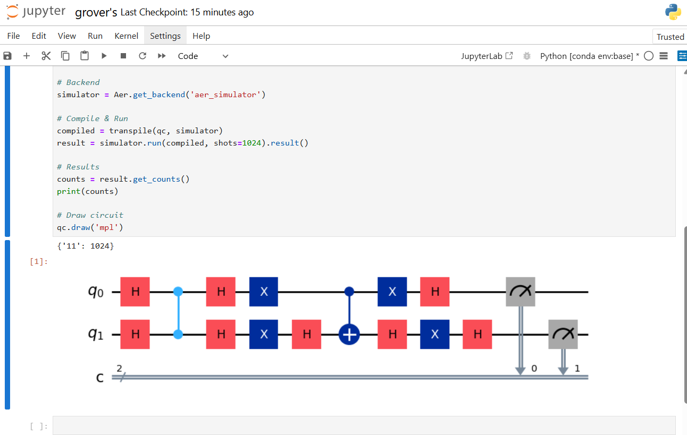

# Grover’s Algorithm using Qiskit

🚀 Implemented using Qiskit Aer Simulator

## 📌 Description

This project demonstrates Grover’s Search Algorithm using Qiskit. It shows how a quantum system can search an unsorted database faster than classical methods by amplifying the probability of the correct solution.

## 🧠 Concept

Grover’s Algorithm is a quantum search algorithm that finds a target item in an unsorted dataset with quadratic speedup compared to classical search.

Steps:

1. Initialize qubits in superposition
2. Apply Oracle (marks the target state)
3. Apply Diffusion Operator (amplifies probability)
4. Measure to obtain the target state

## ⚙️ Tools Used

* Python
* Qiskit
* Jupyter Notebook

## 📊 Output

* Probability distribution showing amplification of the target state
* Circuit visualization of Grover’s algorithm

## 🚀 How to Run

1. Install Qiskit:
   pip install qiskit qiskit-aer matplotlib pylatexenc

2. Run the notebook in Jupyter

## 📷 Results

 
